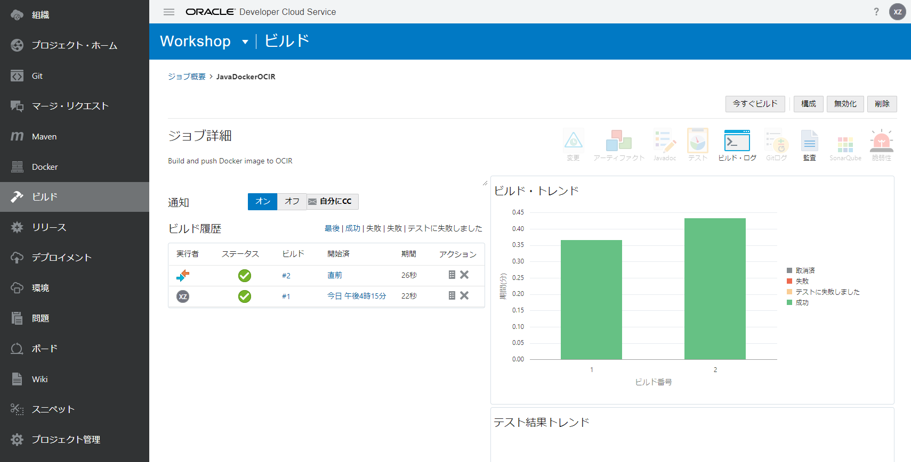

修改应用程序，然后使用DevCS构建功能（CI / CD)将其再次部署到OKE集群
=====

例如，让我们更改Helidon＆JET开发的系统首页的图像。

打开命令提示符，然后转到git repository文件夹。更新映像文件并提交到DevCS存储库。

```
cp src/main/resources/web/images/forsale_new2.jpg src/main/resources/web/images/forsale.jpg
```

转到DevCS的“构建”，作业“ JavaDockerOCIR”的构建将自动开始。如果成功，状态将为。



接下来，作业“ OKEDeploy”的构建自动开始。如果成功，状态将为。


打开浏览器，打开浏览器，然后转到“ http：//公共IP：服务端口”。

显示由Helidon＆JET开发的系统的首页。您可以看到销售图像已更改。


OKE / ATP / DevCS研讨会到此结束。
谢谢你

[转到README](../ README.md)