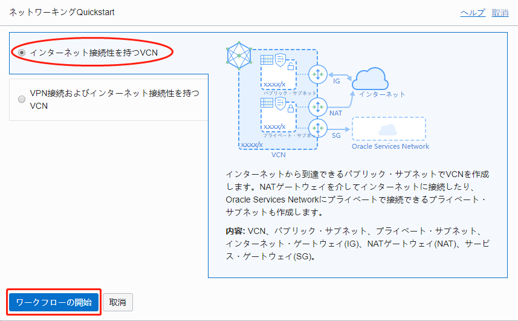
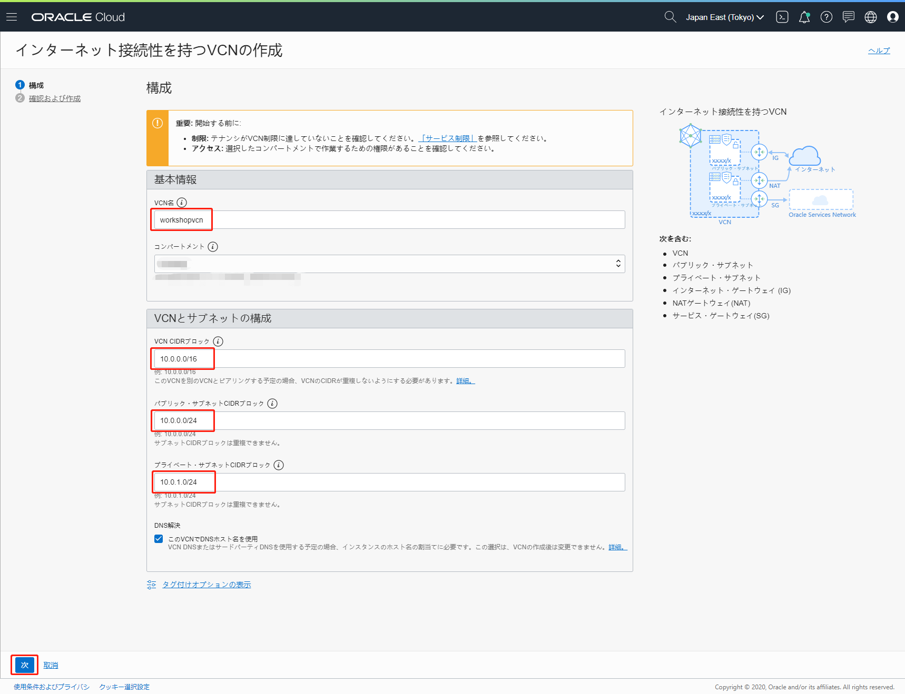
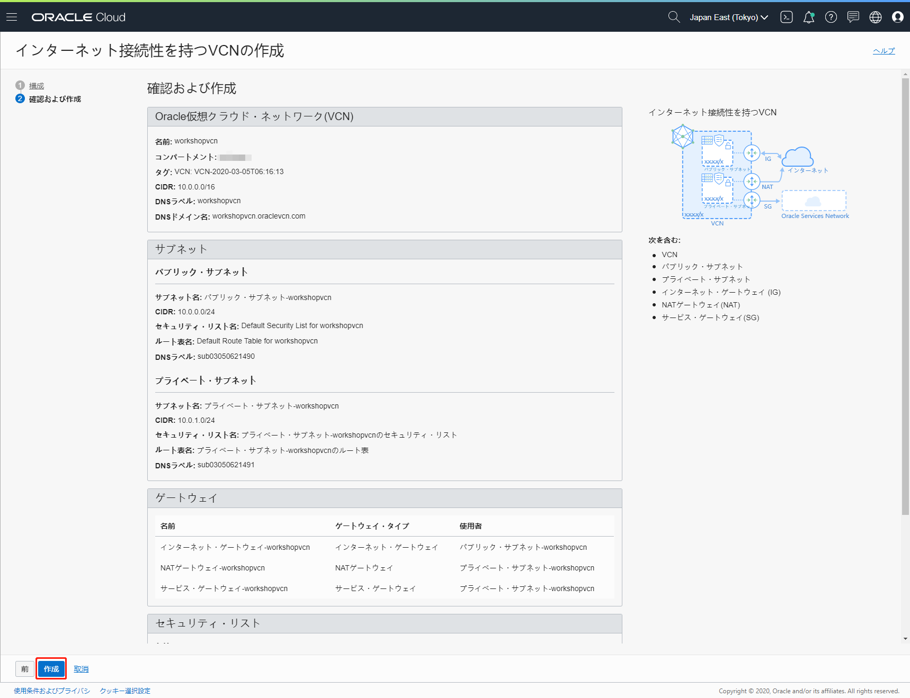
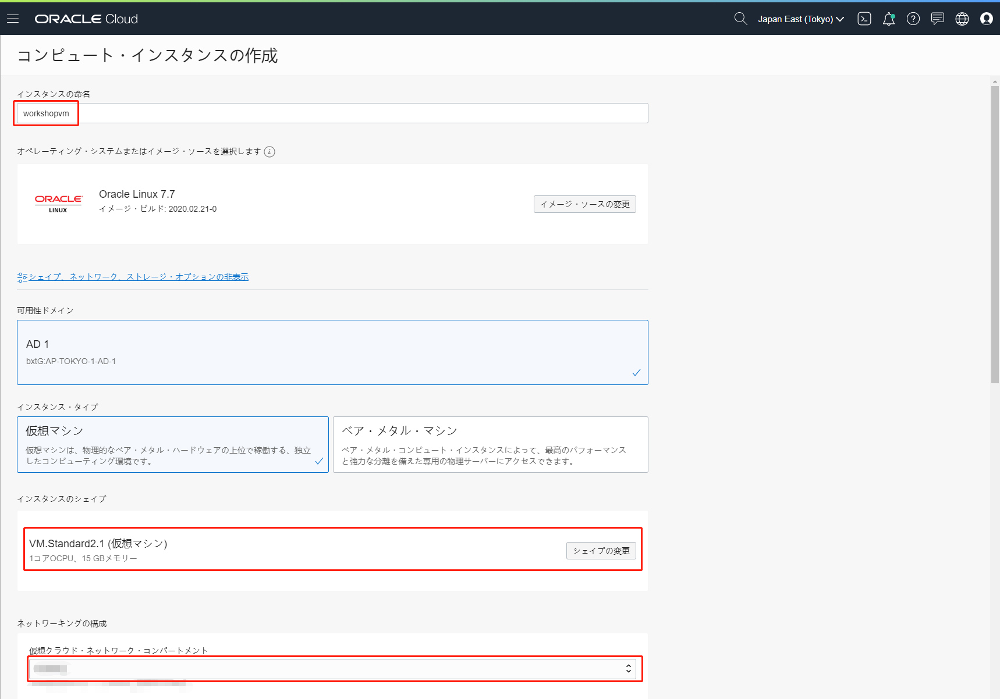
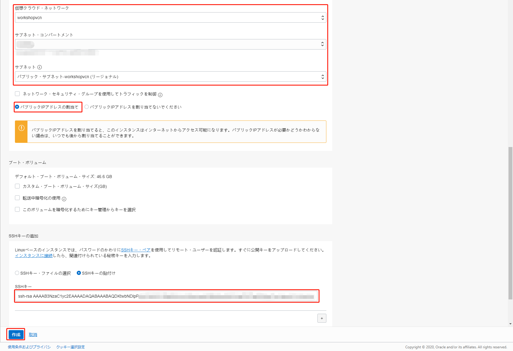
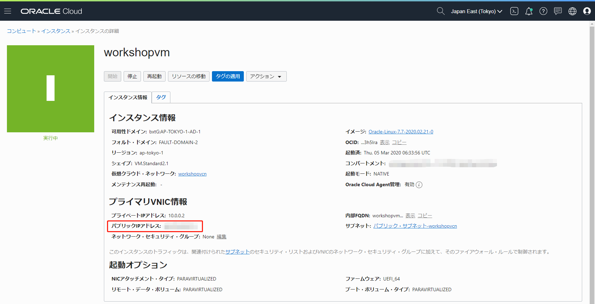
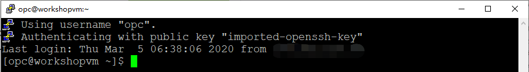

必要なソフトウェアのインストール
======

このワークショップではクライアント端末に以下のソフトウェアが必要となります。
公式サイトの手順に従い、ご利用の端末にあったソフトウェアをインストールしてください。

- [kubectl](https://kubernetes.io/ja/docs/tasks/tools/install-kubectl/) : OKE（Kubernetes）クラスタの操作に使用
- [git](https://git-scm.com/book/ja/v2/%E4%BD%BF%E3%81%84%E5%A7%8B%E3%82%81%E3%82%8B-Git%E3%81%AE%E3%82%A4%E3%83%B3%E3%82%B9%E3%83%88%E3%83%BC%E3%83%AB) : DevCSリポジトリ（Gitリポジトリ）のクローン、ファイルの更新に使用
- [terraform](https://www.terraform.io/downloads.html) ： OKEクラスタとATPの作成に使用

以下の手順ではOCIのコンピュートインスタンス（Oracle Linux）を取得し、上記ソフトウェアをインストールする手順を記載します。この手順が不要な方は[ワークショップで利用するアカウント情報の収集](WorkshopGuide200GatherInformation.md)に進んでください。

OCIのコンピュートインスタンスの取得
-------
以下手順で実行します。

1. 仮想クラウド・ネットワークを取得する
2. コンピュートインスタンスを取得する

#### 1. 仮想クラウド・ネットワークを取得する

OCIコンソール右上のハンバーガーメニューを展開し、「ネットワーキング」⇒「仮想クラウド・ネットワーク」に移動して、「ネットワーキングQuickstart」ボタンをクリックします。

ネットワーキングQuickstart画面で、「インターネット接続性を持つVCN」を選択して、「ワークフローの開始」をクリックします。



インターネット接続性を持つVCNの作成画面で、下記項目を入力して、「次」ボタンをクリックします。

+ VCN前：任意。例えば、`workshopvcn`

+ コンパートメントに作成：ご利用のコンパートメントを選択する。

+ VCN CIDRブロック：たとえば、`10.0.0.0/16`

+ パブリック・サブネットCIDRブロック：たとえば、`10.0.0.0/24`

+ プライベート・サブネットCIDRブロック：たとえば、`10.0.1.0/24`



インターネット接続性を持つVCNの作成画面で、「作成」をクリックします。



これで、仮想クラウド・ネットワークの取得は完了しました。

#### 2. コンピュートインスタンスを取得する

OCIのコンピュートインスタンスを取得するのは、SSHキーペアが必要です。SSHキーペアの作成方法について、[キーペアの作成](https://docs.oracle.com/cd/E97706_01/Content/GSG/Tasks/creatingkeys.htm)をご参照ください。

OCIコンソール右上のハンバーガーメニューを展開し、「コンピュート」⇒「インスタンス」に移動して、「インスタンスの作成」ボタンをクリックします。

コンピュート・インスタンスの作成画面で、「シェイプ、ネットワーク、ストレージ・オプションの表示」をクリックし、下記項目を入力して、「作成」ボタンをクリックします。

入力項目|説明
-|-
インスタンスの命名|任意（例えば、workshopvm）
インスタンスのシェイプ|シェイプを選択する（例えば、VM.Standard2.1）
仮想クラウド・ネットワーク・コンパートメント|ご利用のコンパートメントを選択する
仮想クラウド・ネットワーク|ご利用の仮想クラウド・ネットワークを選択する（例えば、workshopvcn）
サブネット・コンパートメント|ご利用のコンパートメントを選択する
サブネット|インターネットからアクセスするため、"パブリック・サブネット"付きのサブネットを選択する
ネットワークセキュリティグループを使用してトラフィックを制御|選択しない
パブリックIPアドレスの割当て|インターネットからアクセスするため選択
SSHキー|SSHキーペアの作成で作成したPublicキーを貼り付け、または選択





インスタンスの詳細画面が表示され、作成完了したら、ステータスが"実行中"になり、パブリックIPアドレスが表示されます。



sshが実行できる端末（例えば、putty）でOCIのコンピュートインスタンスにアクセスします。例えば、puttyをご利用の場合、下記項目を入力して「Open」ボタンをクリックします。

+ Session  ⇒ Host Name (or IP address)：コンピュートインスタンスのパブリックIPアドレス
+ Connection ⇒ Data  ⇒ Auto-login username：opc
+ Connection ⇒ SSH  ⇒ Auth ⇒ Private key file for authentication：SSH秘密キーパス



これで、OCIのコンピュートインスタンスの取得は完了しました。

ソフトウェアのインストール
---------

ご利用するユーザーのホームディレクトリで、"install_software.sh"のスクリプトを作成します。

```sh
vi install_software.sh
```

下記スクリプト内容をコピーして、保存します。
```sh
#!/bin/bash

echo "Install Start"
echo ""

# set terraform version, by default is 0.12.21 (latest version on 2020-03-05)
if [ "$1" != "" ]
then
    TERRAFORM_VERSION="$1"
else
    TERRAFORM_VERSION=0.12.21
fi

echo "default Terraform Version is v${TERRAFORM_VERSION}"
echo ""

# install git
echo "Installing git ..."
sudo yum install -y git > /dev/null 2>&1

echo "Installed $(git --version)"
echo ""

# install oci
#usage:
# curl -LSs https://raw.githubusercontent.com/oracle-japan/weblogic-operator-handson/scripts/master/bin/install-oci.sh | bash
echo "Installing oci cli ..."
sudo yum install python3 -y > /dev/null 2>&1
rm -rf ~/lib/oracle-cli > /dev/null 2>&1
rm -f ~/oci_install.sh > /dev/null 2>&1
curl -L https://raw.githubusercontent.com/oracle/oci-cli/master/scripts/install/install.sh --output ~/oci_install.sh > /dev/null 2>&1
chmod 755 ~/oci_install.sh > /dev/null 2>&1
~/oci_install.sh --accept-all-defaults > /dev/null 2>&1
rm -f ~/oci_install.sh > /dev/null 2>&1
mkdir -p ~/.oci > /dev/null 2>&1

echo "Installed oci cli version $(oci --version)"
echo ""

# install kubectl
echo "Installing kubectl ..."
curl -LO https://storage.googleapis.com/kubernetes-release/release/$(curl -s https://storage.googleapis.com/kubernetes-release/release/stable.txt)/bin/linux/amd64/kubectl > /dev/null 2>&1
chmod +x ./kubectl > /dev/null 2>&1
sudo mv ./kubectl /usr/local/bin/kubectl > /dev/null 2>&1

echo "Installed kubectl $(kubectl version --client --short)"
echo ""

# install terraform
echo "Installing terraform ..."
wget https://releases.hashicorp.com/terraform/${TERRAFORM_VERSION}/terraform_${TERRAFORM_VERSION}_linux_amd64.zip > /dev/null 2>&1
unzip terraform_${TERRAFORM_VERSION}_linux_amd64.zip > /dev/null 2>&1
sudo mv ./terraform /usr/local/bin/terraform > /dev/null 2>&1

echo "Installed $(terraform version)"
echo ""

echo "Install Complete"
```

"install_software.sh"のスクリプトに実行権限を付与して、実行します。

```sh
chmod +x install_software.sh
```
```sh
./install_software.sh
```

成功した場合、git、kubectl、terraformのバージョン情報が正しく表示されます。

最新Terraformのバージョンは0.12.21以上になる場合、下記のようなメッセージが出力されるかもしれません。

```
Your version of Terraform is out of date! The latest version
is x.yy.zz. You can update by downloading from www.terraform.io/downloads.html
```

その場合、最新のTerraformのバージョンをパラメータとして、"install_software.sh"に渡して再度実行してください。

```
./install_software.sh x.yy.zz
```

例えば
```
./install_software.sh 0.12.21
```

これで、ソフトウェアのインストールは完了しました。

続いて[ワークショップで利用するアカウント情報の収集](WorkshopGuide200GatherInformation.md)に進んでください。

[ワークショップTopへ](../README.md)