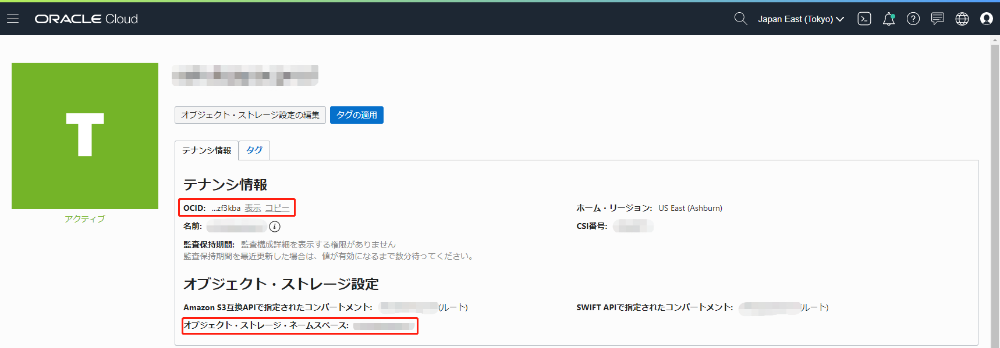
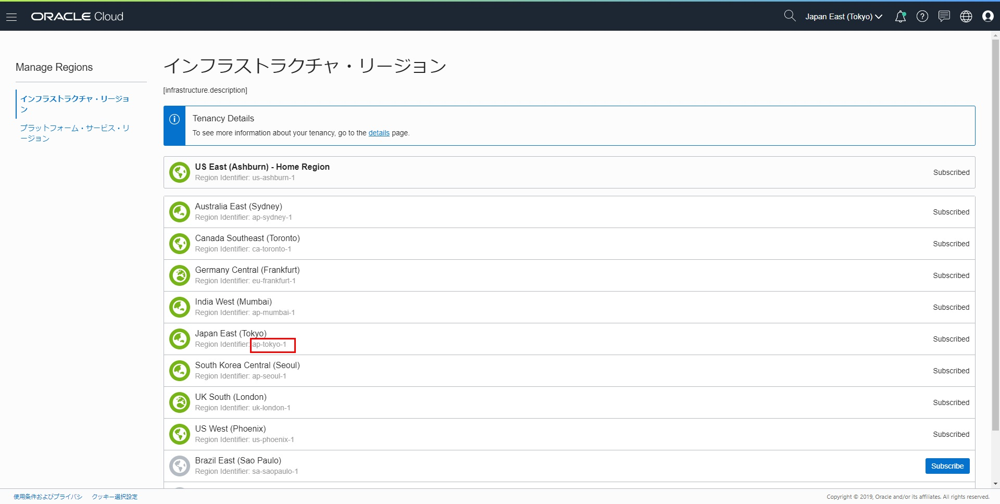
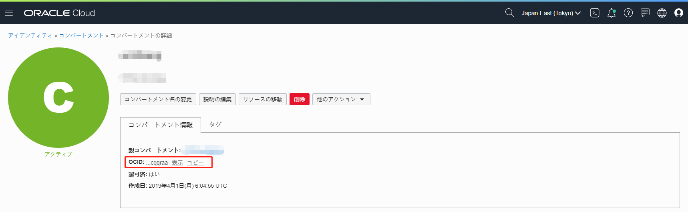
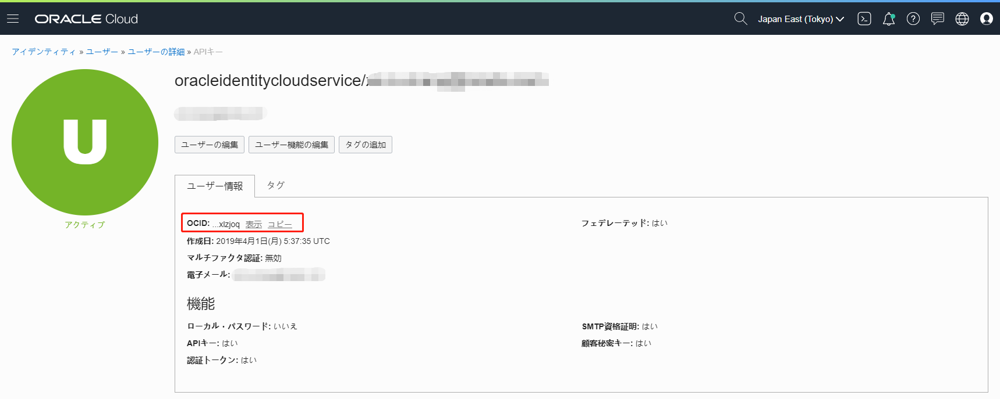
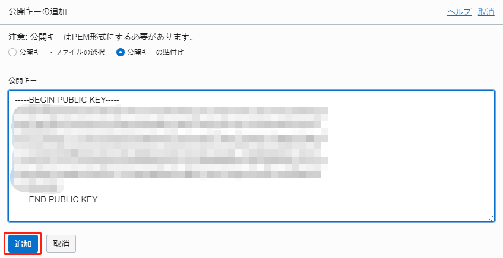
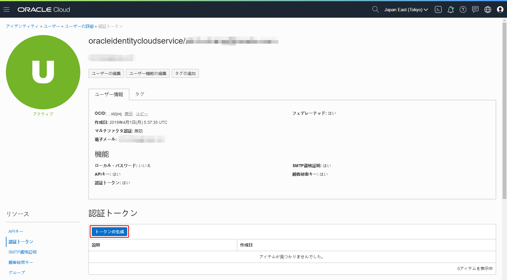
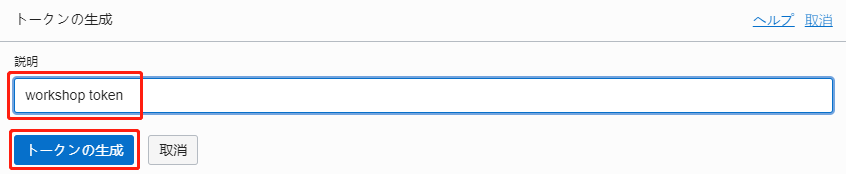
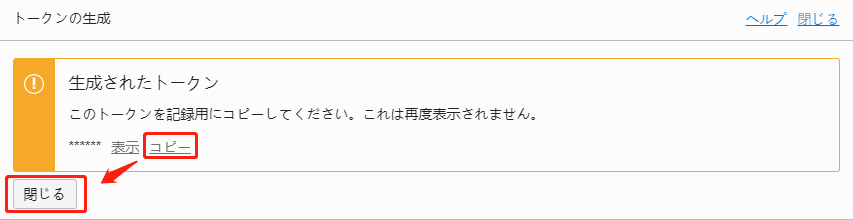

收集研讨会中使用的帐户信息
=====

收集信息(例如一组OCID)以使用OCI
------
进行研讨会需要以下信息。 **请将获得的信息保存在记事本等中，以备后用。 **

1.租户OCID
2.对象存储名称空间
3.区域标识符
4.隔间OCID
5.用户OCID

6. API签名私钥的本地路径
7. API签名密钥指纹

#### 1.租户OCID / 2.对象存储命名空间

展开OCI控制台右上方的汉堡菜单，然后转到“管理”->“租户详细信息”。

复制并注意以下内容：

+ OCID：租户OCID
+对象存储名称空间：对象存储名称空间



#### 3.区域标识符

展开OCI控制台右上方的汉堡菜单，然后转到“管理”->“区域管理”。

复制并注意以下内容：
+区域标识符：区域标识符

如果在日本使用数据中心“ Japan East(Tokyo)”，它将是“ ap-tokyo-1”。



#### 4.隔间OCID

展开OCI控制台右上方的汉堡菜单，然后转到“身份”⇒“隔间”。从隔离专区列表中导航到要使用的隔离专区。

复制并注意以下内容：
+ OCID：隔间OCID


#### 5.用户OCID

展开OCI控制台右上方的汉堡菜单，然后转到“身份”->“用户”。从用户列表中导航到要使用的用户。

复制并注意以下内容：
+ OCID：用户OCID



#### 6. API签名私钥本地路径

如果您没有API签名密钥，请参考[如何创建API签名密钥](https://docs.cloud.oracle.com/iaas/Content/API/Concepts/apisigningkey.htm)创建一个。

范例：

要在没有密码的情况下为API签名生成私钥，
```
openssl genrsa -out ~/.oci/oci_api_key.pem 2048
chmod go-rwx ~/.oci/oci_api_key.pem
```

要生成用于API签名的公钥，
```
openssl rsa -pubout -in ~/.oci/oci_api_key.pem -out ~/.oci/oci_api_key_public.pem
```

〜/ .oci / oci_api_key.pem是API签名私钥的本地路径。获取绝对路径并记下它。

要启用API签名私钥，您需要在用户详细信息屏幕上添加相应的公钥。

转到用户详细信息屏幕上的“ API密钥”。


输入API签名的公共密钥，然后单击“添加”按钮。



#### 7. API签名密钥指纹

要获取API签名密钥的指纹，请执行以下命令。

复制并记下下面的输出。
```
openssl rsa -pubout -outform DER -in〜/ .oci / oci_api_key.pem | openssl md5 -c
```

#### 8.身份验证令牌

从计算机或OKE收集身份验证令牌以使用OCIR(您需要身份验证令牌，而不是用于用户身份验证的密码)。

展开OCI控制台右上方的汉堡菜单，然后转到“身份”->“用户”。从用户列表移至要使用的用户。

转到“资源”的“身份验证令牌”，然后单击“生成令牌”按钮。



输入以下项目，然后单击“生成令牌”按钮。

+说明：可选(例如研讨会令牌)



**生成的令牌仅显示一次。单击“复制”以复制令牌并将其保存在所需的位置。完成后，单击“关闭”按钮。 (注意：如果您忘记了，请删除创建的令牌并再次生成。)



现在，您已经收集了该研讨会的帐户信息。

然后转到[使用DevCS创建项目和存储库](WorkshopGuide300CreateProjectRepository.md)。

[转到README](../ README.md)