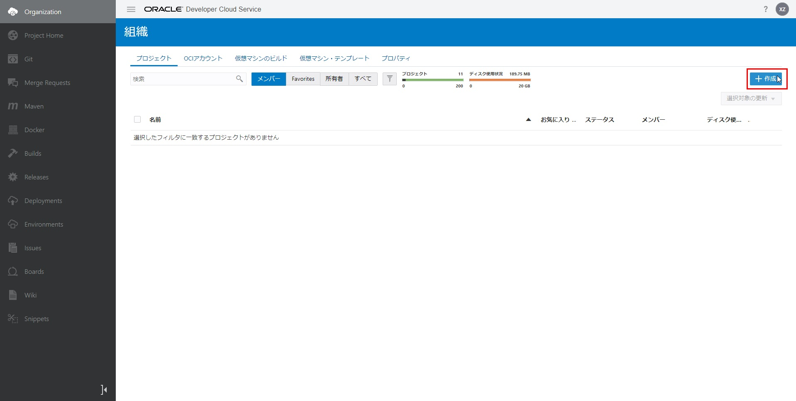
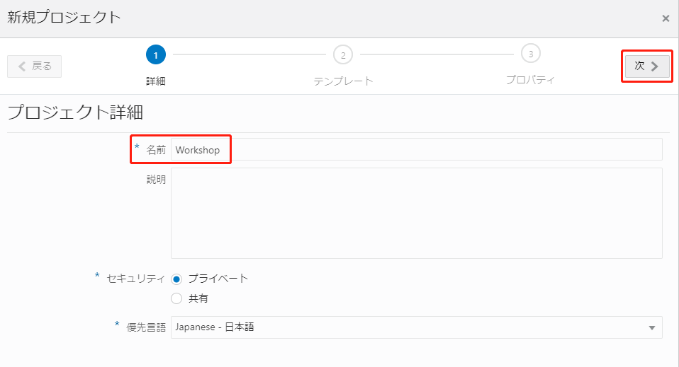
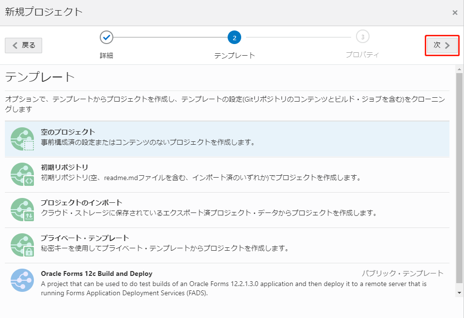
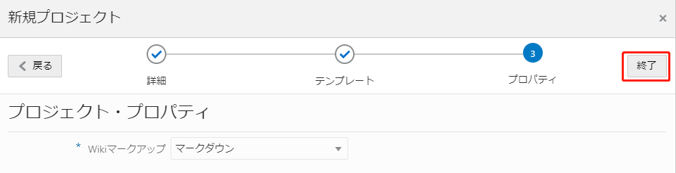
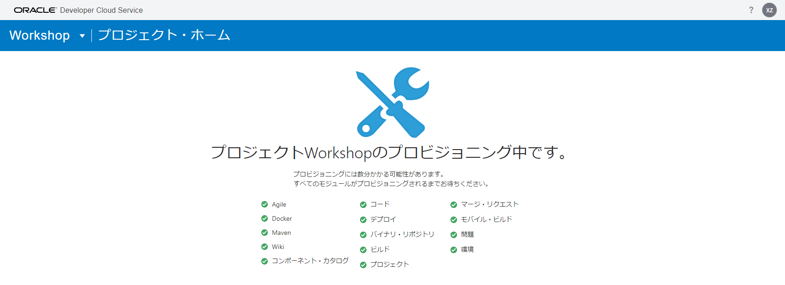
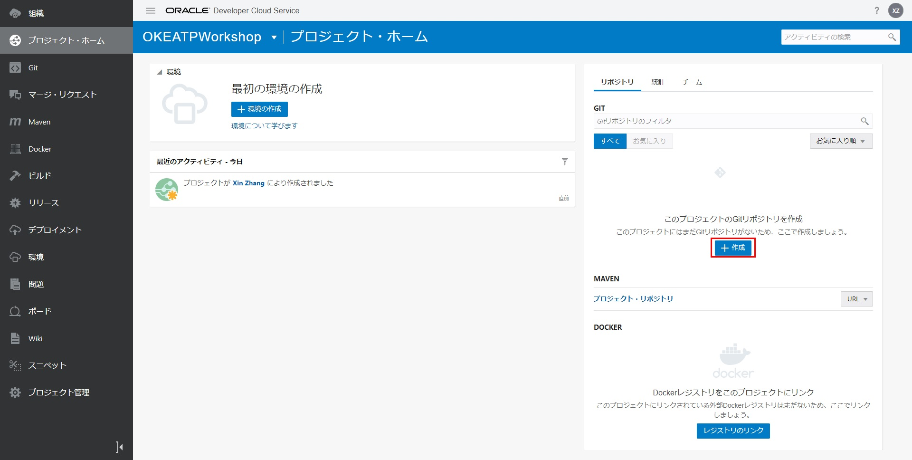
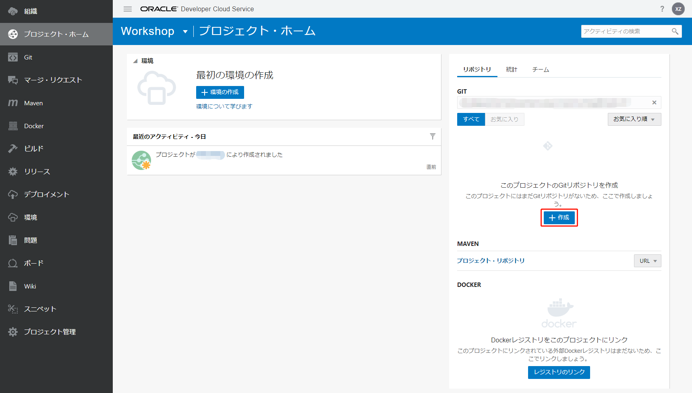
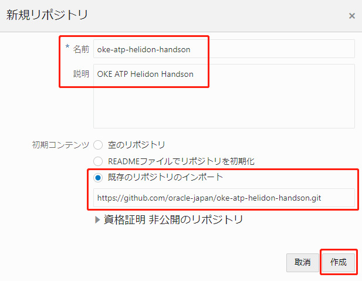
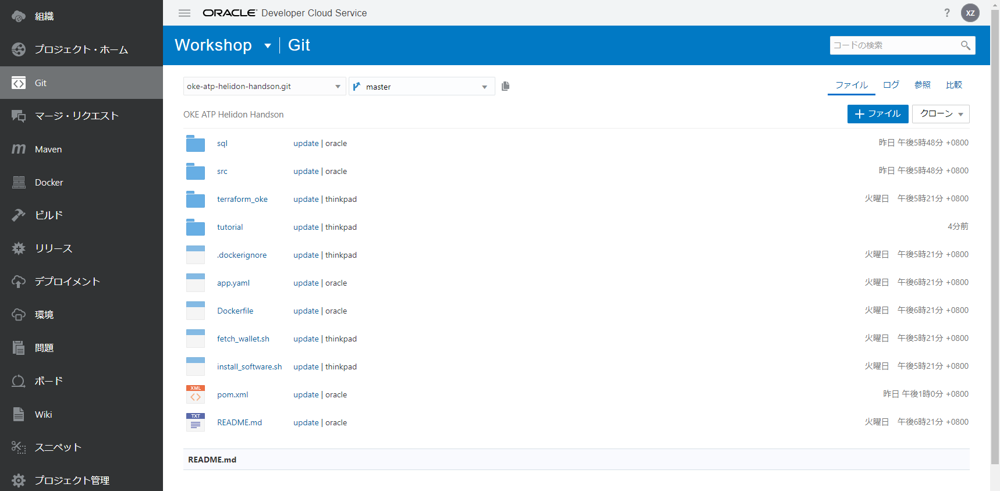
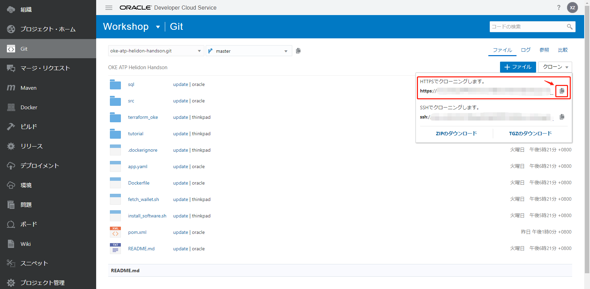

DevCSでプロジェクトとリポジトリの作成
=========

このステップでは、GitHubリポジトリに基づいてDevCSで新しい開発者プロジェクトをセットアップする方法を説明します。

一つDevCSのインスタンスは、複数のプロジェクトを管理できます。また、一つのプロジェクトは複数のリポジトリを管理できます。

プロジェクトを作成するには、「組織」メニューを選択し、「プロジェクト」タブで右側の「＋作成」ボタンをクリックします。



下記項目を入力して、「次」をクリックします。

+ 名前：任意（例えば、Workshop）



デフォルトのままにして、「次」をクリックします。



デフォルトのままにして、「終了」をクリックします。



すべてのモジュールがプロビジョンされるまでお待ちください。



プロジェクトの作成が完了すると、自動的にこちらの画面に移動されます。

リポジトリを作成するには、「＋作成」をクリックします。





下記項目を入力して、「作成」をクリックします。

+ 名前：任意（例えば、`oke-atp-helidon-handson`）
+ 説明：任意（例えば、`OKE ATP Helidon Handson`）
+ 既存のリポジトリのインポート：`https://github.com/oracle-japan/oke-atp-helidon-handson.git`



インポートが完了すると、既存のリポジトリのファイルがインポートされます。



作成したリポジトリをご利用のマシンへコピーします。

DevCSで「Git」に移動して、右側の「クローン」を選択し、"HTTPSでクローニングします"の「コピー」アイコンをクリックします。



ご利用のマシンの作業フォルダに移動して、クローンを実行します。

```
git clone コピーされたURL
```

これで、DevCSでプロジェクトとリポジトリの作成は完了しました。

続いて[DevCSでビルド機能（CI/CD）使用の仮想マシンの準備](WorkshopGuide400CreateVirtualMachine.md)に進んでください。

[ワークショップTopへ](../README.md)