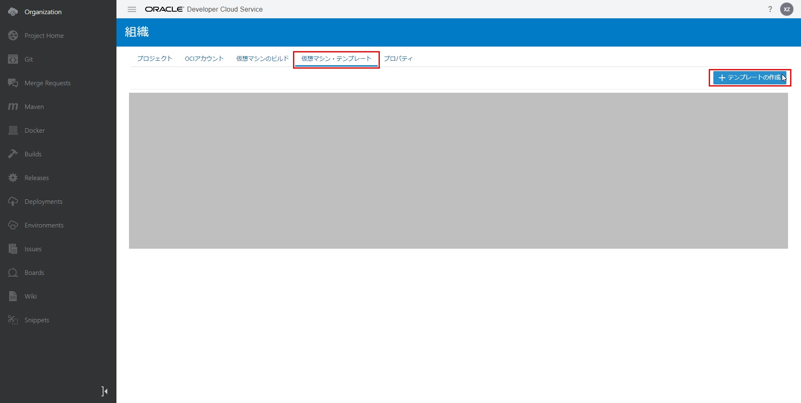
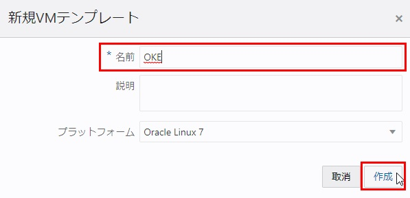
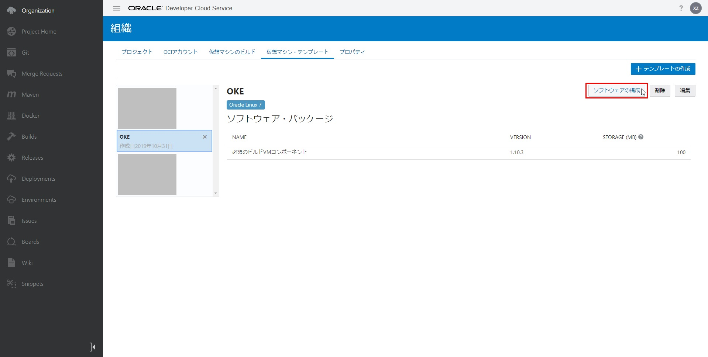
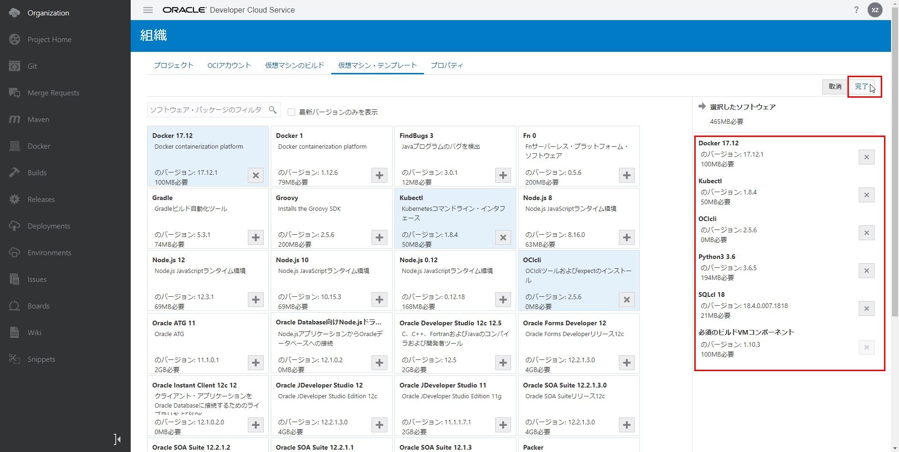
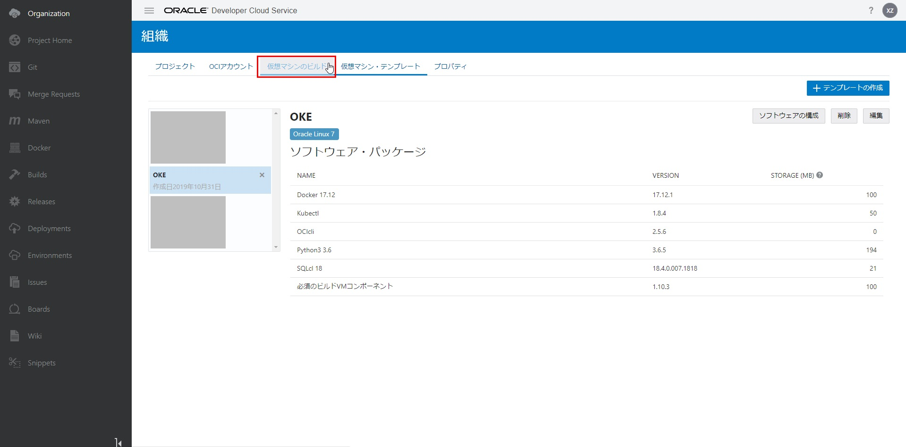
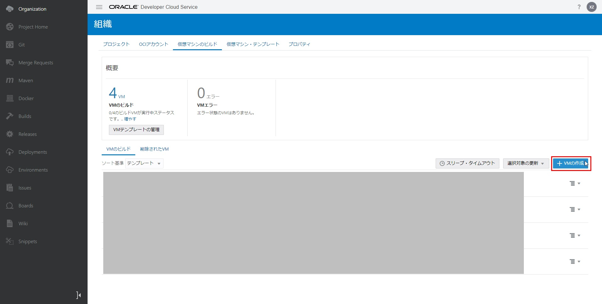
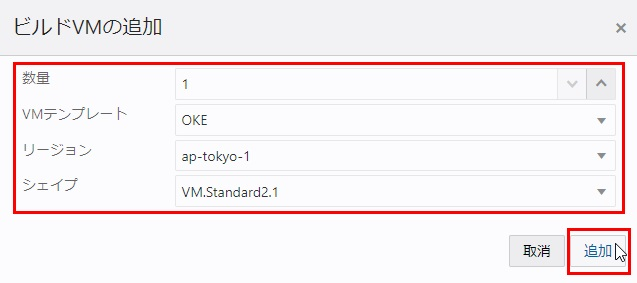

DevCSでビルド機能（CI/CD）用の仮想マシンの準備
=====
このステップでは、DevCSでのビルド機能（CI/CD）を使用する際に必要なビルド用の仮想マシンを用意します。

DevCSで「組織」メニューを選択し、「仮想マシン・テンプレート」のタブに移動して、「＋テンプレートの作成」ボタンをクリックします。

ダイアログボックスで、下記項目を入力して、「作成」ボタンをクリックします。

+ 名前：任意（例えば、OKE）
+ プラットフォーム：デフォルトOracle Linux 7（状況に応じて、他のプラットフォームを選択してください）

作成したテンプレート"OKE"を選択し、「ソフトウェアの構成」ボタンをクリックして、必要なソフトウェアパッケージを追加します。

次のパッケージを選択します。

+ Docker 17.12
+ Kubectl
+ OCIcli ==> Python3 も同時にインストールするように求められます
+ SQLcl 18

「完了」ボタンをクリックします。

「仮想マシンのビルド」タブに移動します。

「＋VMの作成」ボタンをクリックします。

表示されるダイアログで、下記項目を入力します。

+ 数量：1
+ VMテンプレート：OKE
+ リージョン：ap-tokyo-1（日本の東京データセンターを利用するため）
+ シェイプ：VM.Standard2.1（状況に応じて、他のシェイプを選択してください）

「追加」ボタンをクリックします。

これで、DevCSのセットアップのすべては完了しました。

続いて[Terraformを使用したOKEクラスタの作成](WorkshopGuide500ProvisionOKECluster.md)に進んでください。

[ワークショップTopへ](../README.md)