DevCSのビルド機能（CI/CD）を使用して、ATPへデータ導入
=====
このステップでは、DevCSのビルド機能（CI/CD）を使用して、いくつかのテーブルを作成し、ATPにデータを導入します。

DevCSのビルドエンジンを使用して、データベースに必要なオブジェクトを作成し、データをテーブルに導入するフローを設定します。リポジトリでこれらの要素が変更された場合、スクリプトは再度トリガーされ、データベース要素を再作成します。

下記手順で実行します。

1. ビルドジョブを作成、実行し、データベースオブジェクトを作成する
2. SQL Developer Webを介して検証する

### 1. ビルドジョブを作成、実行し、データベースオブジェクトを作成する

DevCSで、「ビルド」に移動し、「＋ジョブを作成」ボタンをクリックします。

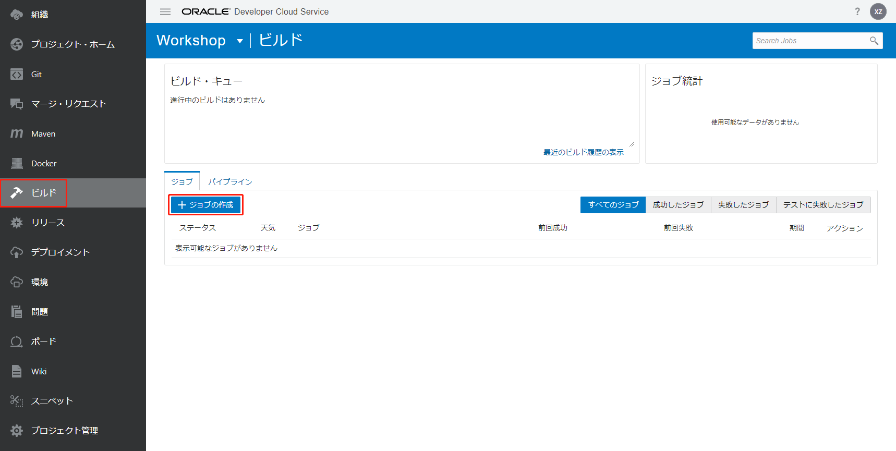

下記項目を入力し、「作成」ボタンをクリックします。

+ 名前：任意（例えば、`CreateDBObjects`）
+ テンプレート：`OKE`

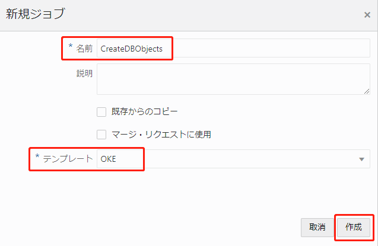

gitソースリポジトリを追加します。「Git追加」から「git」を選択します。

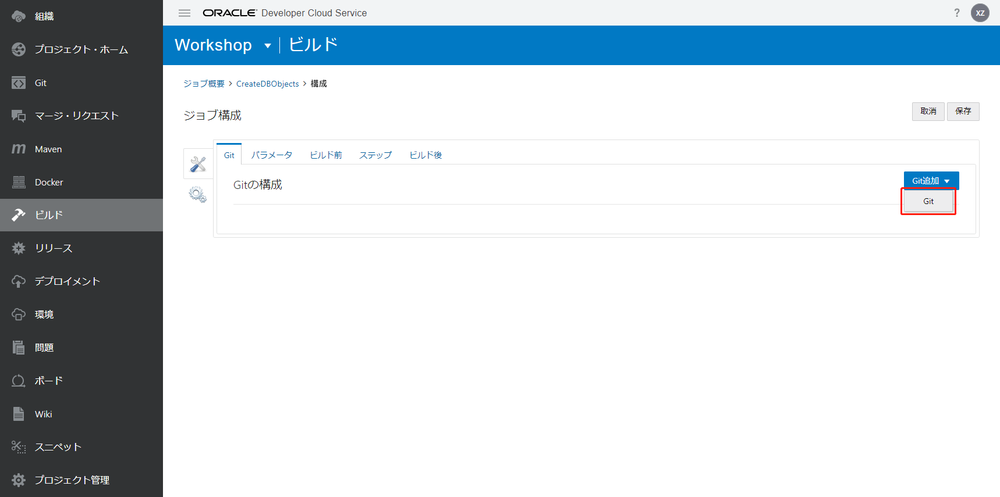

下記項目を入力します。

+ リポジトリ：ご利用のリポジトリを選択する

次のステップを追加します。「ステップ」をクリックします。

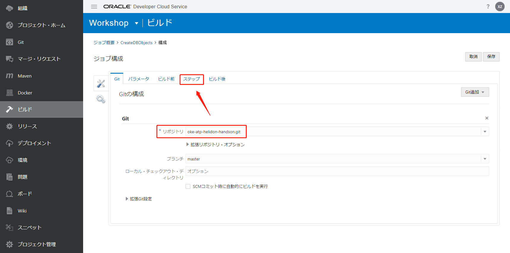

「ステップの追加」から「SQLcl」を選択します。

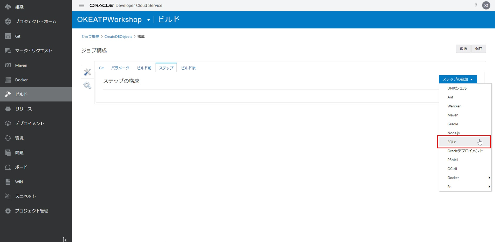

下記項目を入力して、「保存」ボタンをクリックします。

+ ユーザー名：ATPデータベースのユーザー名（例えば、`admin`）
+ パスワード：ATPデータベースのパスワード（例えば、`WOrkshop__8080`）
+ 資格証明ファイル：ウォレットファイルのパス（例えば、`./wallet.zip`）
+ 接続文字列：データベースの名前＆`_high`/`_low`などで構成される接続文字列（例えば、`workshopatp_high`）
+ SQLファイル・パス：作成スクリプトを含むsqlファイルのパス（例えば、`sql/create_schema.sql`）

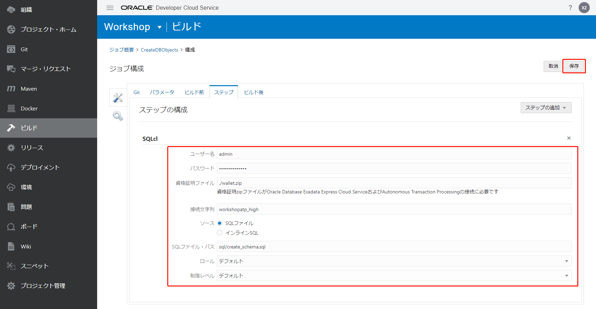

「今すぐビルド」ボタンをクリックします。

これが環境内で最初のビルドジョブである場合、ビルドエンジンの起動が完了するまでに最大10分かかる場合があります。

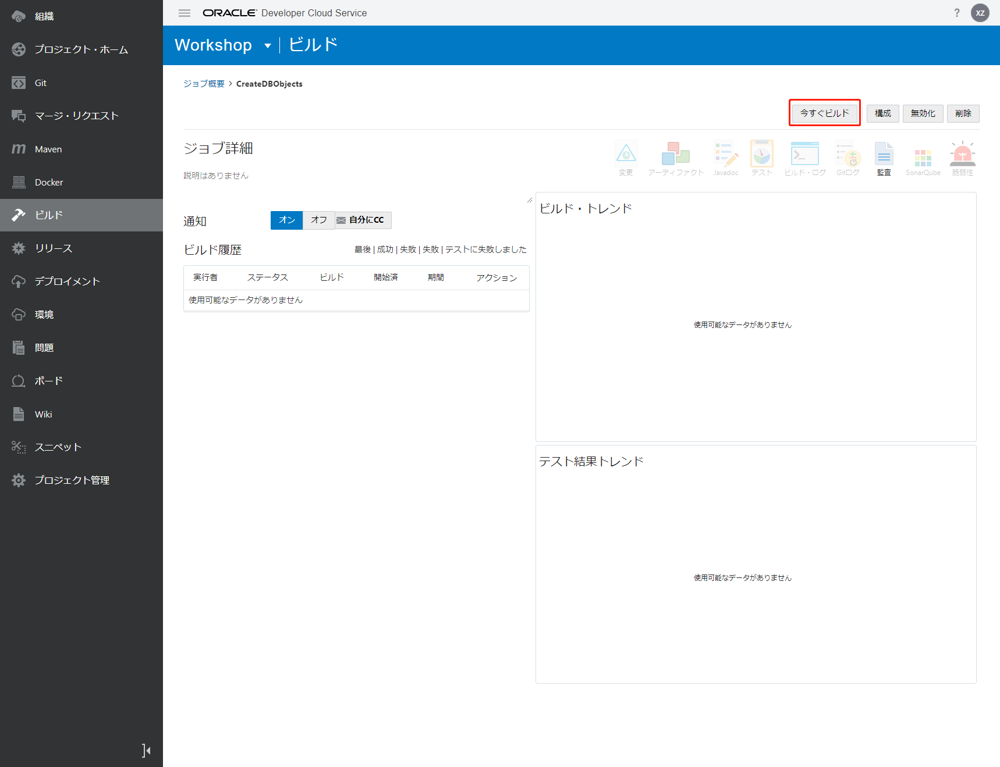

ビルド途中または完了、「ビルド・ログ」アイコンをクリックして、ログを確認できます。

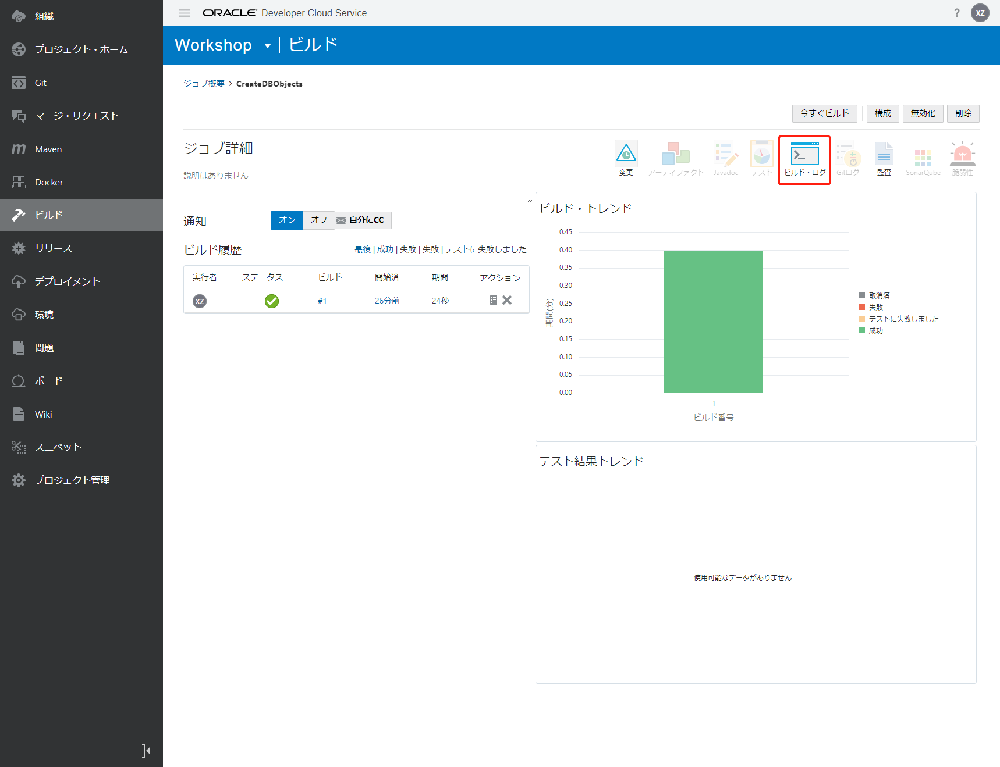

成功すると、ログの最後に"Status:DONE Result:SUCCESSFUL"と表示されます。また、SQL実行の詳細な内容を確認できます。

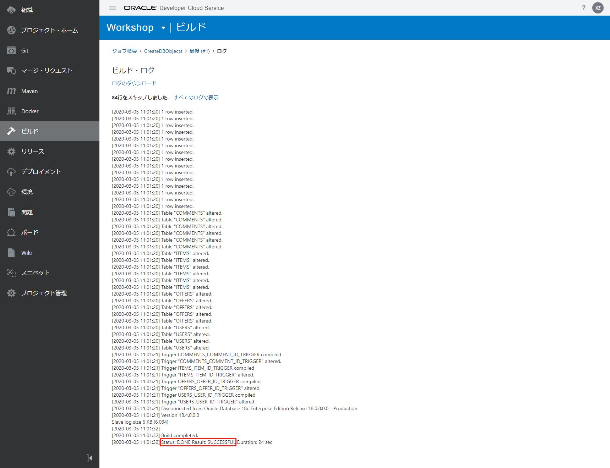

ビルドマシンのログも確認できます。

DevCSで、「組織」⇒「仮想マシンのビルド」⇒「VMのビルド」で使用したテンプレートを選択して、右側のメニューアイコンから「ログの表示」を選択します。

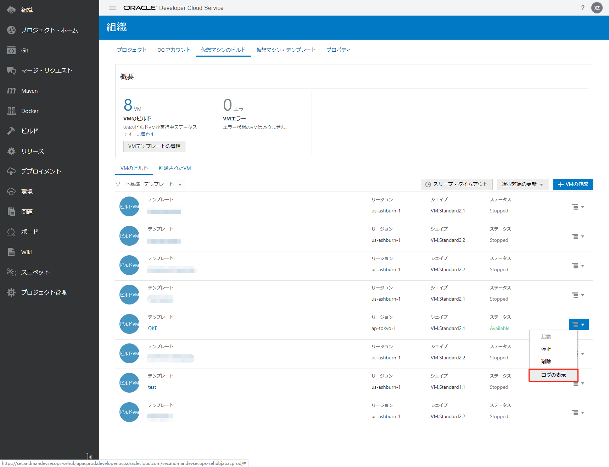

仮想マシンのログが表示されます。

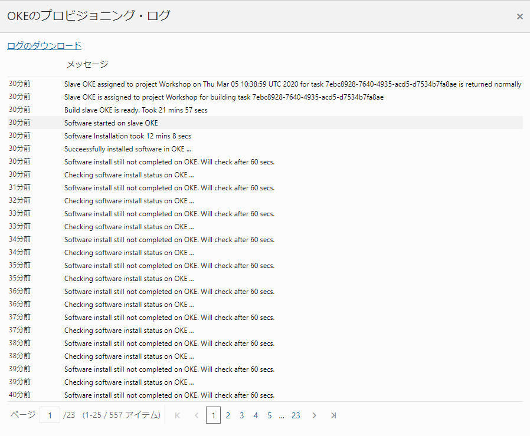

これで、データの導入は完了しました。

###  2. SQL Developer Webを介して検証する

SQL Developer Webを使用してデータベースに接続し、オブジェクトが正しく作成されたことを確認できます。

OCIのATPデータベースインスタンスの詳細⇒「サービス・コンソール」ボタンをクリックします。

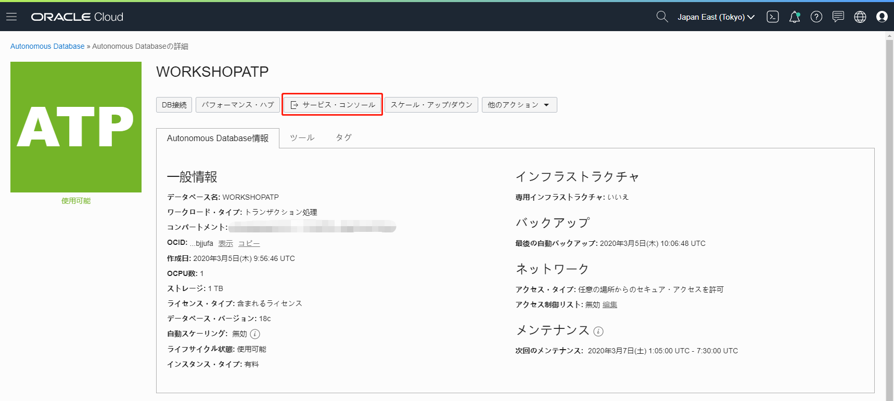

「Deployment」をクリックします。

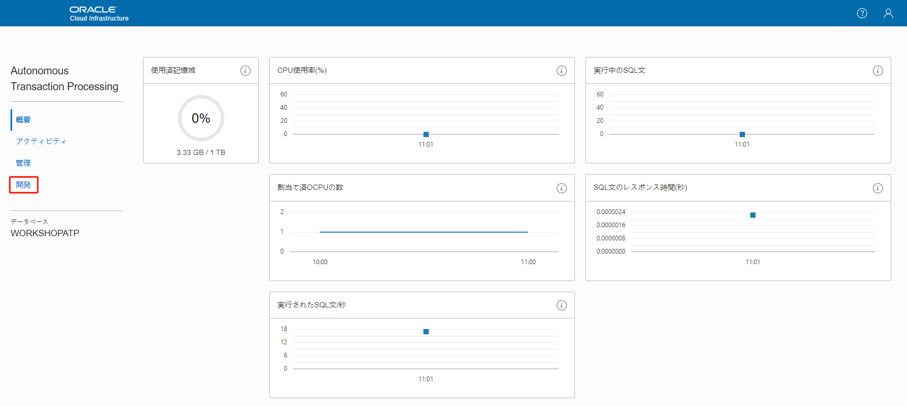

「SQL Developer Web」をクリックします。

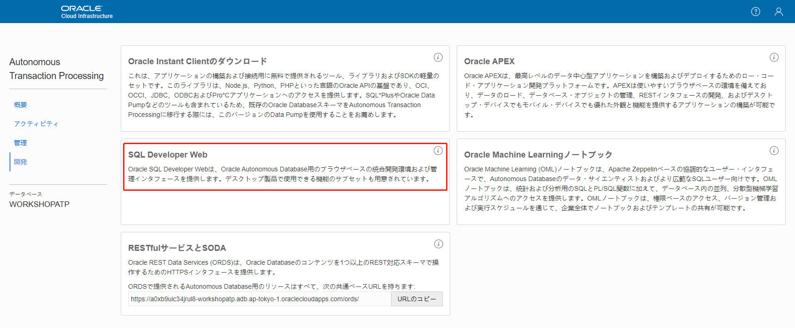

下記項目を入力し、「Sign in」をクリックします。

+ Username：ATPデータベースのユーザー名、例えば、`admin`
+ Password：ATPデータベースのパスワード、例えば、`WOrkshop__8080`

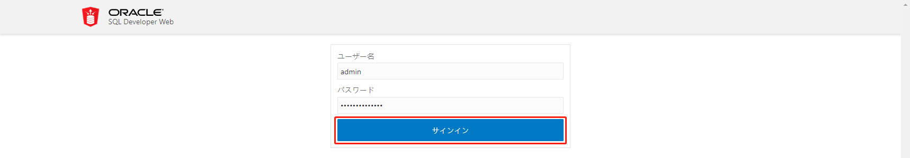

SQL Developer Webのワークシートで`select * from ITEMS`を入力して、緑色の矢印「ステートメントの実行」アイコンをクリックします。

ITEMSテーブルの結果が表示されます。

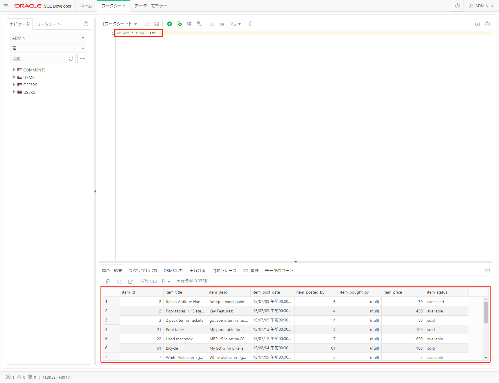

これで、データの導入および検証は完了しました。

続いて[DevCSのビルド機能（CI/CD）を使用して、アプリケーションのDockerイメージを作成、OCIRへの登録](WorkshopGuide800CreateImageToOCIR.md)に進んでください。

[ワークショップTopへ](../README.md)