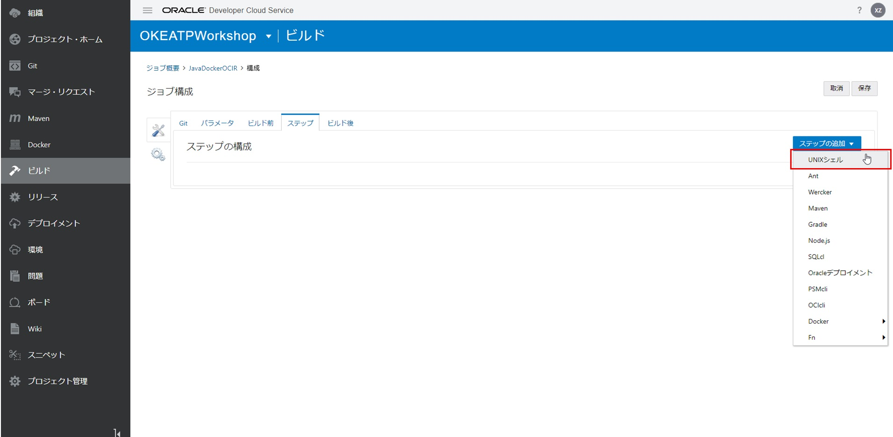
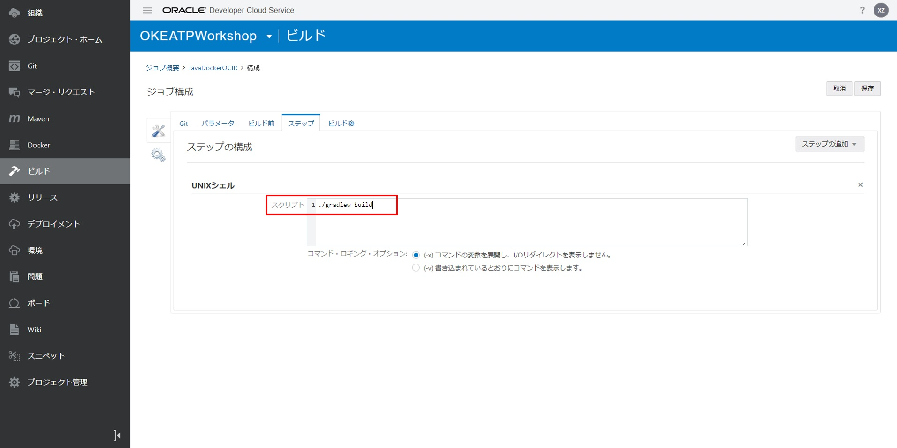
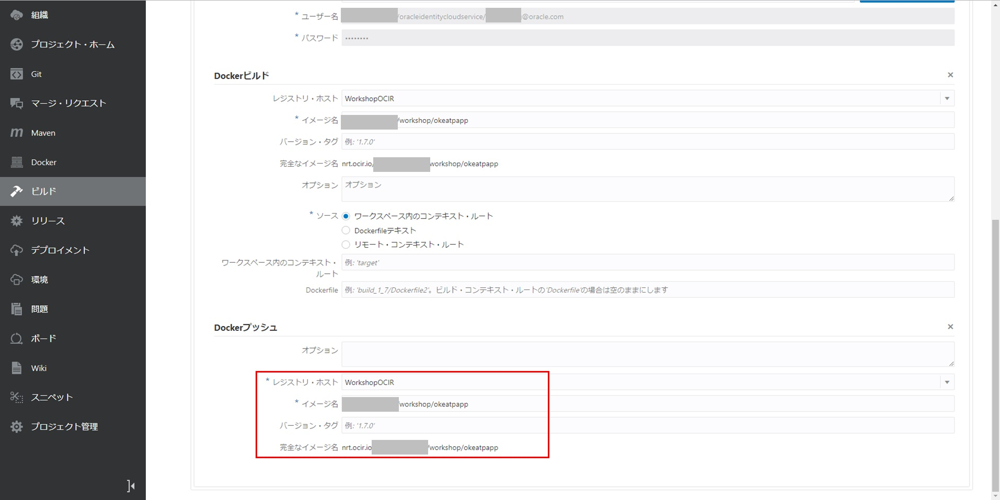

DevCSのビルド機能（CI/CD）を使用して、アプリケーションのDockerイメージを作成、OCIRへの登録
=======
このステップでは、DevCS上でJava Webアプリケーション（データソースとしてATPデータベースを使用）のDockerイメージを作成する方法を説明します。

ここではHelidon＆JETで開発したアプリケーションを使用してコンテナイメージを作成します。

以下手順で実行します。

1. OCIRリポジトリへの接続を構成する
2. イメージを作成・プッシュするためのDockerビルドジョブを構成する
3. ビルドジョブを実行する

### 1. OCIRリポジトリへの接続を構成する

DevCSで「Docker」に移動して、「外部レジストリのリンク」ボタンをクリックします。

下記項目を入力して、「作成」ボタンをクリックします。

+ レジストリ名：任意（例えば、WorkshopOCIR）
+ レジストリURL：OCIRのレジストリURL。https://<リージョンコード>.ocir.io（例えば、Tokyoデータセンターの場合は、"https://nrt.ocir.io"）
+ 短い説明：任意（例えば、"Workshop OCIR"）
+ ユーザー名：`オブジェクト・ストレージ・ネームスペース/OCIにログインするユーザー名`（例えば、`オブジェクト・ストレージ・ネームスペース/aaaa.bbbb@oracle.com`または`オブジェクト・ストレージ・ネームスペース/oracleidentitycloudservice/aaaa.bbbb@oracle.com`）
+ パスワード：書き留めた認証トークン

成功すると、外部レジストリの情報が表示されます。

### 2. イメージを作成・プッシュするためのDockerビルドジョブを構成する

「ビルド」に移動して、「＋ジョブの作成」をクリックします。

下記項目を入力して、「作成」ボタンをクリックします。

+ 名前：任意（例えば、JavaDockerOCIR）
+ 説明：任意（例えば、"Build and push Docker image to OCIR"）
+ テンプレート：OKE

右側の「Git追加」から「Git」を選択します。

下記項目を入力します。

次のステップを追加します。「ステップ」をクリックします。

+ リポジトリ：ご利用のリポジトリを選択する
+ SCMコミット時に自動的にビルドを実行：チェックオンにする

「ステップの追加」から「UNIXシェル」を選択します。

下記項目を入力します。

+ スクリプト：`./gradlew build`

「ステップの追加」から「Docker」⇒「Dockerログイン」を選択します。

下記項目を入力します。

+ レジストリ・ホスト：入力したレジストリ名を選択します。例えば、WorkshopOCIR

「ステップの追加」から「Docker」⇒「Dockerビルド」を選択します。

下記項目を入力します。

+ レジスト・ホスト：入力したレジストリ名を選択する（例えば、WorkshopOCIR）
+ イメージ名：`オブジェクト・ストレージ・ネームスペース/オプション/イメージ名`で構成される（例えば、`オブジェクト・ストレージ・ネームスペース/workshop/okeatpapp`）

「ステップの追加」から「Docker」⇒「Dockerプッシュ」を選択します。

下記項目を入力します。

+ レジスト・ホスト：入力したレジストリ名を選択します。例えば、WorkshopOCIR
+ イメージ名：`オブジェクト・ストレージ・ネームスペース/オプション/イメージ名`で構成されます（例えば、`オブジェクト・ストレージ・ネームスペース/workshop/okeatpapp`）

「保存」ボタンをクリックします。

### 3. ビルドジョブを実行する

「今すぐビルド」ボタンをクリックします。

成功すると、ステータスがになります。

OCIのOCIRに移動すると、okeatpappのイメージがプッシュされたことを確認できます。

これで、アプリケーションをイメージに作成して、OCIRへのプッシュは完了しました。

続いて [DevCSのビルド機能（CI/CD）を使用して、アプリケーションをOKEクラスタへのデプロイ](WorkshopGuide900DeployToOKECluster.md) に進んでください。

[ワークショップTopへ](../README.md)