使用DevCS构建功能(CI / CD)创建应用程序的Docker映像并注册到OCIR
=======
此步骤描述如何在DevCS上创建Java Web应用程序的Docker映像(使用ATP数据库作为数据源)。

在这里，使用Helidon＆JET开发的应用程序创建了容器映像。

请按照以下步骤操作。

1. 配置与OCIR信息库的连接
2. 配置Docker构建作业以创建和推送映像
3. 执行构建作业

### 1.配置与OCIR信息库的连接

在DevCS中转到“Docker”，然后单击“外部注册表链接”按钮。

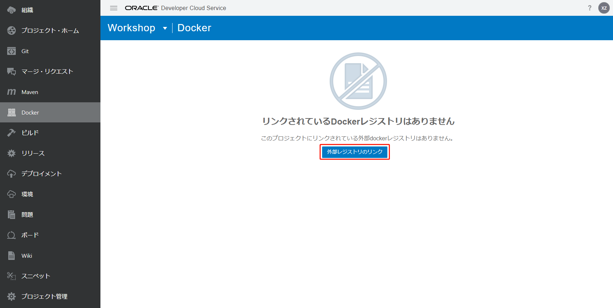

输入以下项目，然后单击“创建”按钮。

+ 注册表名称：任意(例如`WorkshopOCIR`)
+ 注册表URL：OCIR注册表URL。 https：// <区域代码> .ocir.io(例如，东京数据中心为`https://nrt.ocir.io`)
+ 简短说明：任意(例如`Workshop OCIR`)
+ 用户名：`用于登录对象存储命名空间/ OCI的用户名`(例如，`对象存储命名空间/oracleidentitycloudservice/aaaa.bbbb@oracle.com`或`对象存储命名空间/oracleidentitycloudservice/aaaa.bbbb@oracle.com`)
+ 密码：您写下的身份验证令牌

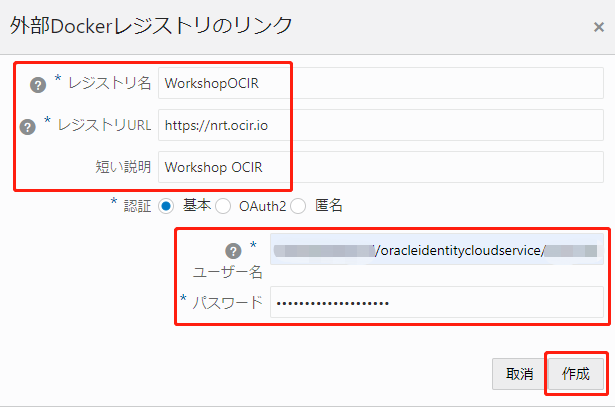

如果成功，将显示来自外部注册表的信息。

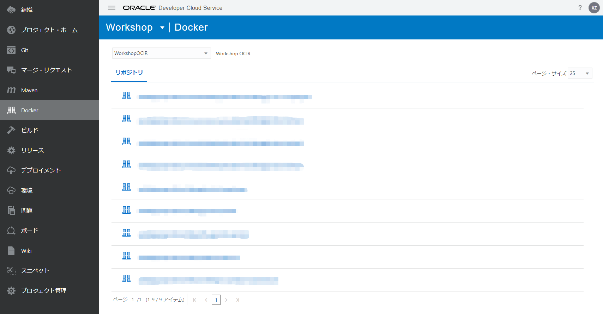

### 2.配置Docker构建作业以创建和推送映像

转到“构建”，然后单击“ +创建作业”。

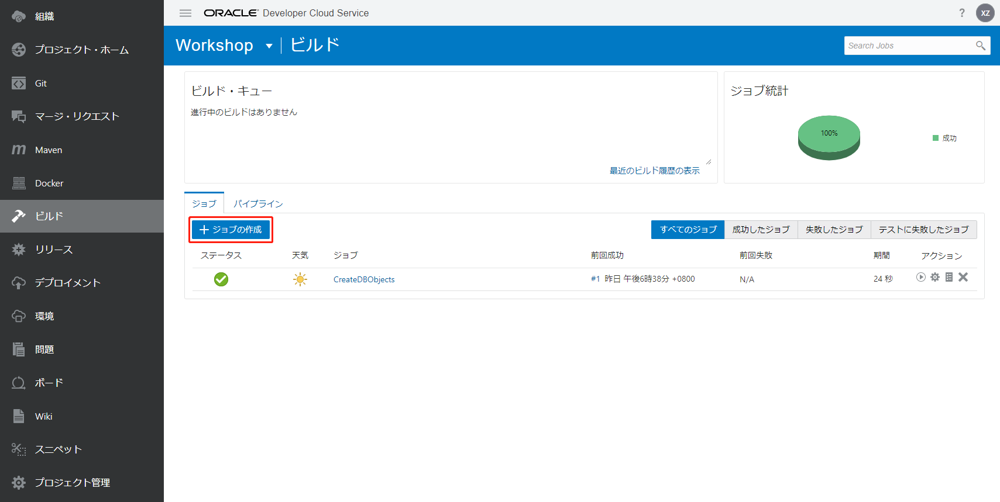

输入以下项目，然后单击“创建”按钮。

+ 名称：任意(例如，JavaDockerOCIR)
+ 说明：可选(例如“构建Docker映像并推送到OCIR”)
+ 模板：OKE

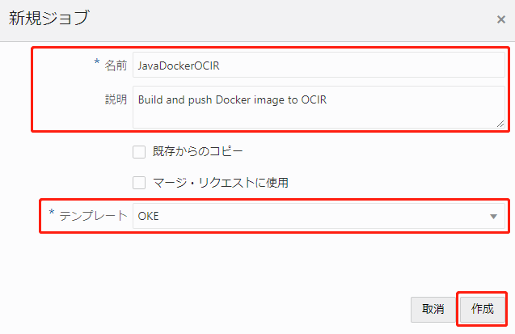

从右侧的“添加Git”中选择“ Git”。

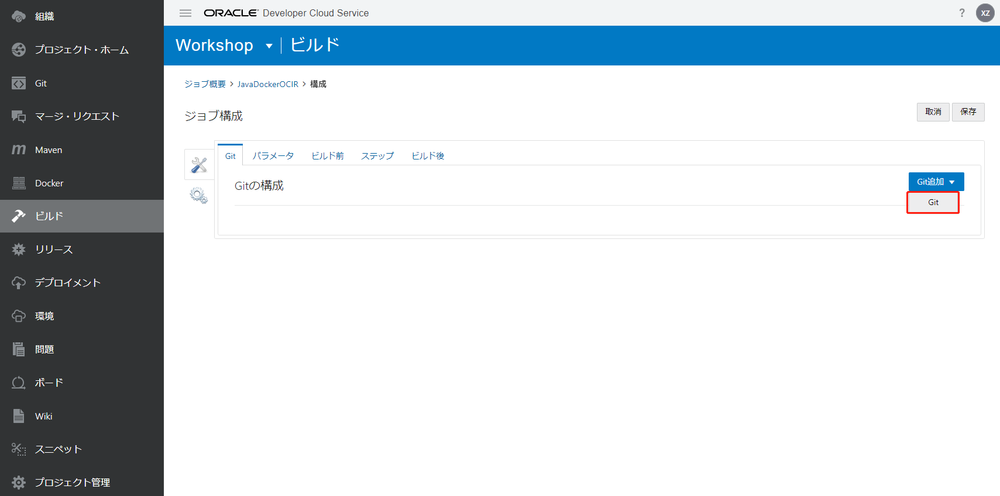

输入以下项目。

添加以下步骤：点击“步骤”。

+ 储存库：选择您的储存库
+ 在SCM提交上自动运行构建：选中

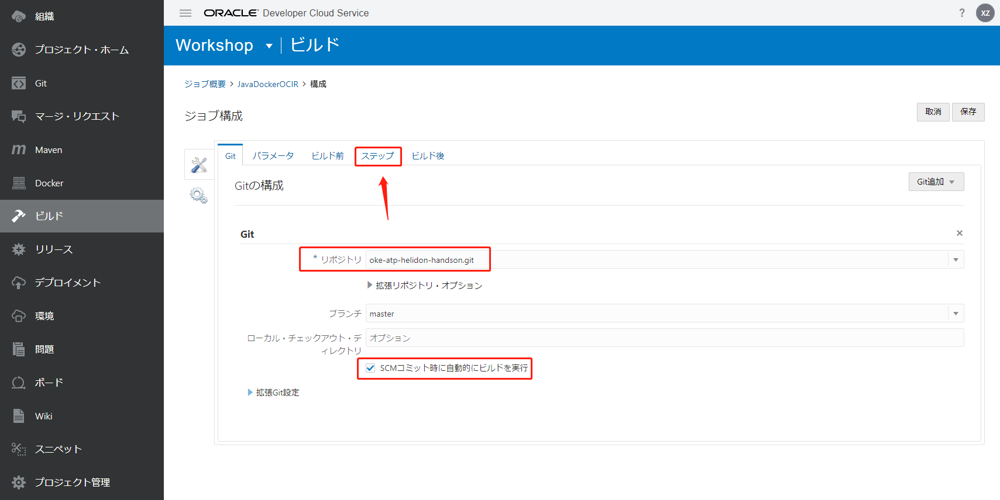

从“添加步骤”中，选择“ Docker”->“ Docker登录”。

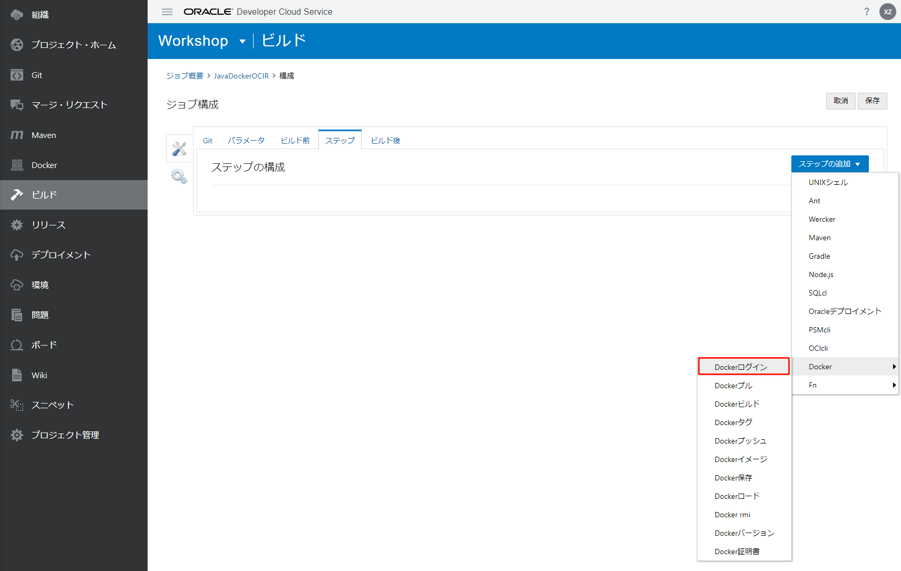

输入以下项目。

+ 注册表主机：选择输入的注册表名称。例如，WorkshopOCIR

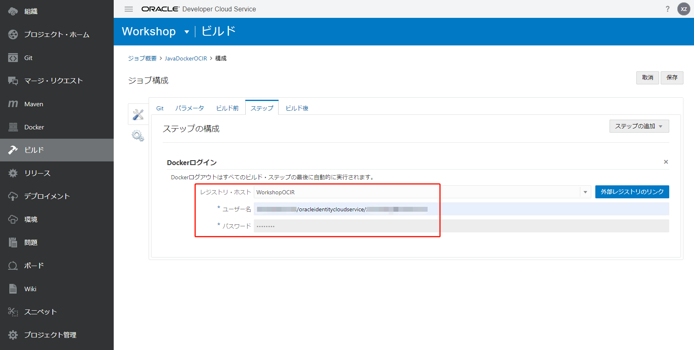

从“添加步骤”中，选择“ Docker”->“ Docker Build”。

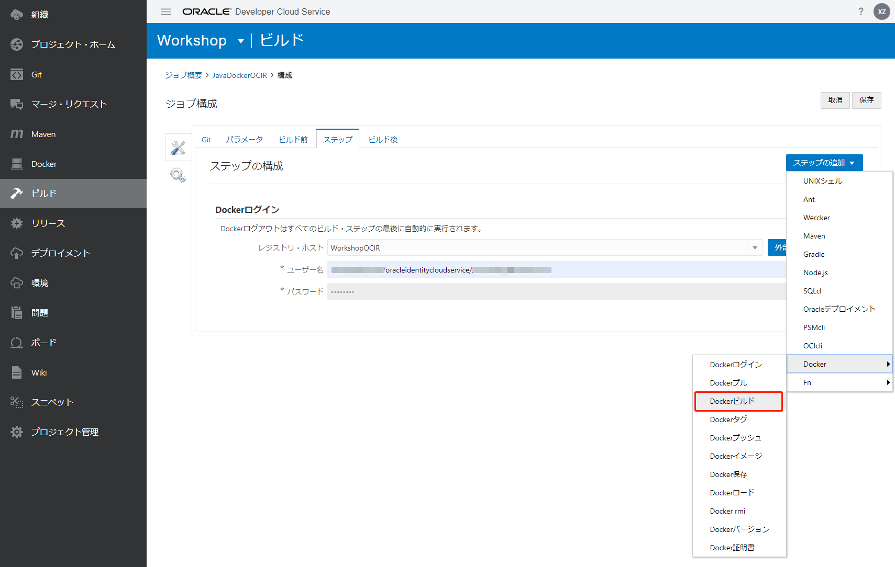

输入以下项目。

+ 注册表主机：选择输入的注册表名称(例如WorkshopOCIR)
+ 图像名称：由“对象存储名称空间/选项/图像名称”组成(例如，“对象存储名称空间/workshop/ okeatpapp”)

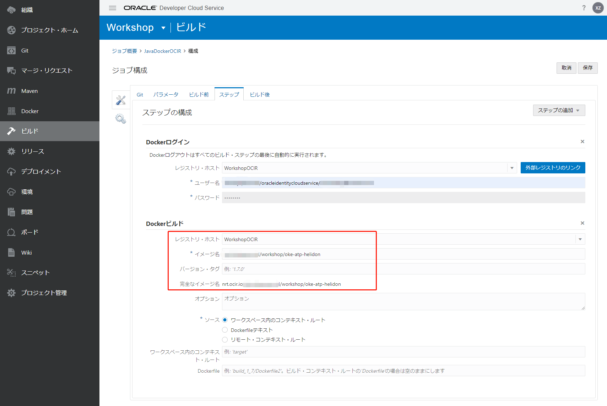

从“添加步骤”中，选择“ Docker”->“ Docker Push”。

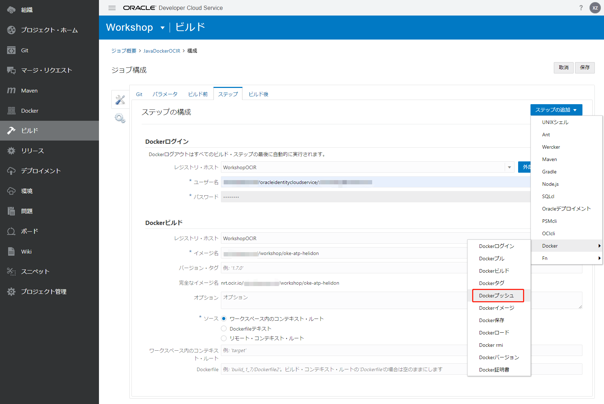

输入以下项目。

+ 注册表主机：选择输入的注册表名称。例如，WorkshopOCIR
+ 映像名称：由“对象存储命名空间/选项/映像名称”组成(例如，“对象存储命名空间/workshop/oke-atp-helidon”)

点击“保存”按钮。

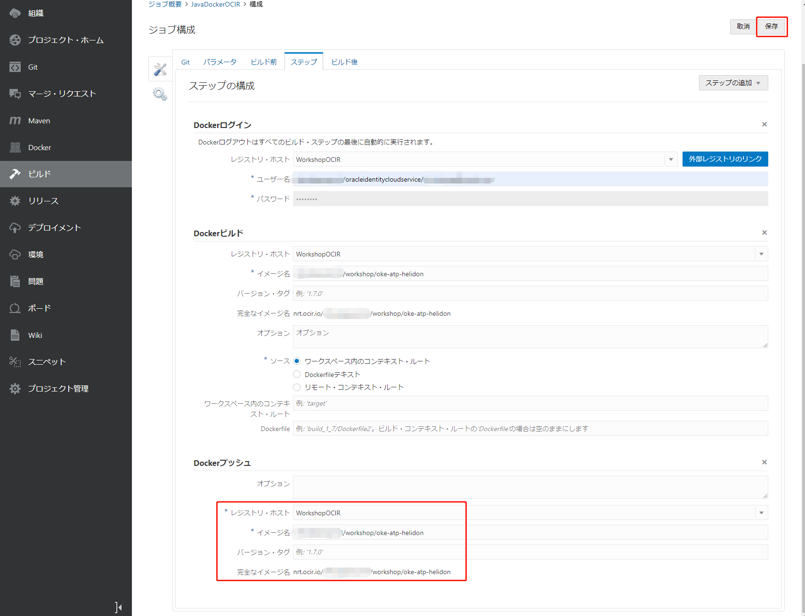

### 3.执行构建作业

单击“立即构建”按钮。

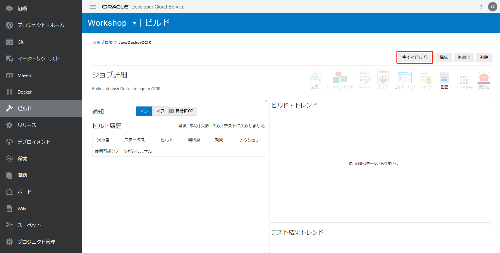

如果成功，状态将为。

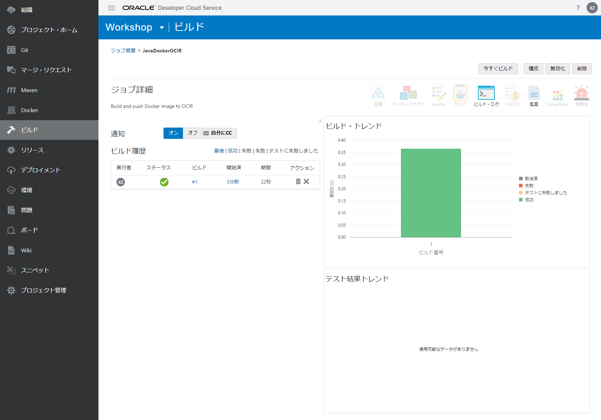

转到OCI的OCIR，您可以看到“ oke-atp-helidon”图像已被推送。

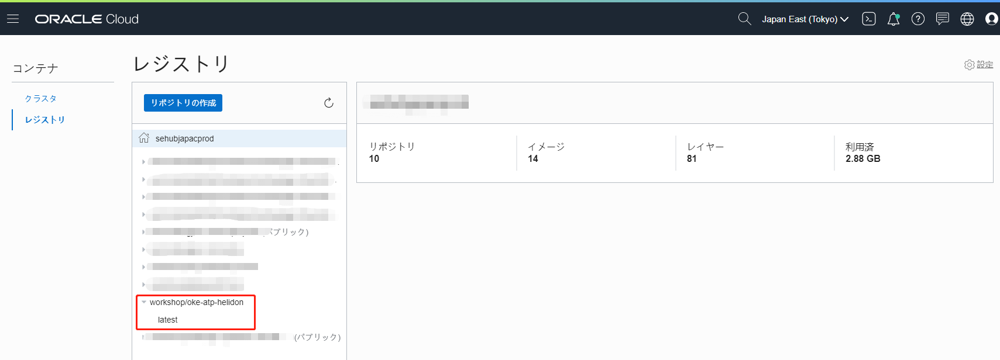

您已经在图像中创建了一个应用程序并将其推送到OCIR。

接下来，继续[使用DevCS构建功能(CI / CD)将应用程序部署到OKE集群](WorkshopGuide900DeployToOKECluster.md)。

[转到README](../ README.md)