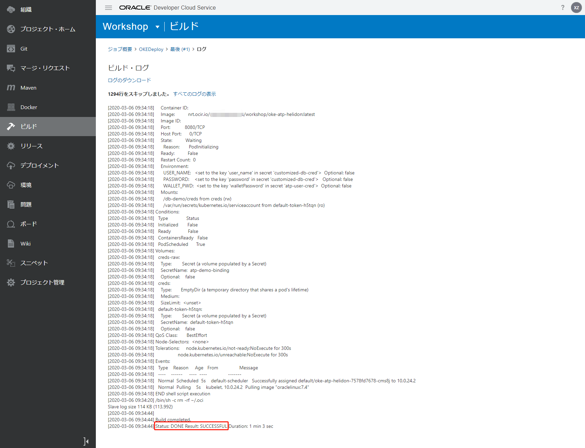

使用DevCS构建功能(CI/CD)将应用程序部署到OKE集群
=====
在此步骤中，您将创建一个新的构建作业，并将该应用程序部署到您设置的OKE集群中。

请按照以下步骤操作。

1. 配置构建作业以将应用程序部署到OKE集群
2. 执行构建作业
3. 验证已部署的应用程序

### 1.配置构建作业以将应用程序部署到OKE集群

在DevCS中，转到“构建”，然后单击“ +创建作业”按钮。


输入以下项目，然后单击“创建”按钮。

+ 名称：任意，例如OKEDeploy
+ 说明：可选，例如“将应用程序部署到OKE”
+ 模板：OKE


从“添加Git”中选择“ Git”。


输入以下项目。

添加以下步骤：点击“步骤”。

+ 储存库：选择您的储存库
+ 在SCM提交上自动运行构建：选中

从“添加步骤”中选择“ Docker”⇒“ Docker登录”。


输入以下项目。

+ 注册表主机：选择输入的注册表名称。例如，WorkshopOCIR


从添加步骤中选择OCIcli。


输入以下项目。

+ 用户OCID：用户OCID
+ 指纹：API签名密钥指纹
+ 租约：租户OCID
+ 私钥：API签名私钥的内容(不是API签名私钥的本地路径)
+ 地区：地区标识符。例如，“ ap-seoul-1”


从“添加步骤”中选择“ UNIX Shell”。


输入以下项目，然后单击“保存”按钮。

+ 脚本：用--cluster-id替换为您写下的命令(⇒创建OKE集群的kubeconfig文件的命令)
+ 用您自己的信息替换`kubectl create secret docker-registry workshop-ocirsecret`命令。

```
mkdir -p $HOME/.kube
oci ce cluster create-kubeconfig --cluster-id ocid1.cluster.oc1.ap-tokyo-1.aaaaaaaaaxxxxxxxxxxxxxxxxxxxxxxxxxxxxxxxxxxxxxxxxxxxxxxxxxxx --file $HOME/.kube/config --region ap-tokyo-1 --token-version 2.0.0
export KUBECONFIG=$HOME/.kube/config
kubectl version
kubectl config view
kubectl get nodes
kubectl delete secret customized-db-cred --ignore-not-found=true
kubectl delete deployment oke-atp-helidon --ignore-not-found=true
kubectl create secret docker-registry workshop-ocirsecret --docker-server=<your-registry-server> --docker-username=<your-name> --docker-password=<your-pword> --docker-email=<your-email>
kubectl apply -f oke-atp-helidon.yaml
kubectl get services oke-atp-helidon
kubectl get pods
kubectl describe pods
```


### 2.执行构建作业

单击“立即构建”按钮。


如果成功，状态将为。

单击生成日志。


如果成功，则显示“状态：完成结果：成功”。



### 3.验证已部署的应用程序

使用`kubectl get services | grep oke-atp-helidon`检查已部署服务的端口。

在车间中，服务端口将为“ 31205”。

```
oke-atp-helidon                      NodePort    10.2.142.208   <none>        8080:31205/TCP   6m37s
```

使用`kubectl get nodes -o wide`来检查OKE集群的工作节点的公共IP(EXTERNAL-IP)。

```
NAME        STATUS   ROLES   AGE   VERSION   INTERNAL-IP   EXTERNAL-IP      OS-IMAGE                  KERNEL-VERSION                   CONTAINER-RUNTIME
10.0.24.2   Ready    node    24h   v1.14.8   10.0.24.2     xxx.xxx.xxx.xx   Oracle Linux Server 7.6   4.14.35-1902.2.0.el7uek.x86_64   docker://18.9.8
```

打开浏览器，然后转到`http://公共IP:服务端口`。 (*对于OKE群集的工作节点的子网所使用的安全列表的进入规则，有必要释放服务端口*)

显示由Helidon＆JET开发的系统的首页。


该应用程序现已部署到OKE。

接下来，继续[修改应用程序并再次使用DevCS构建功能(CI/CD)部署到OKE集群](WorkshopGuide1000RedeployToOKECluster.md)。

[转到README](../README.md)