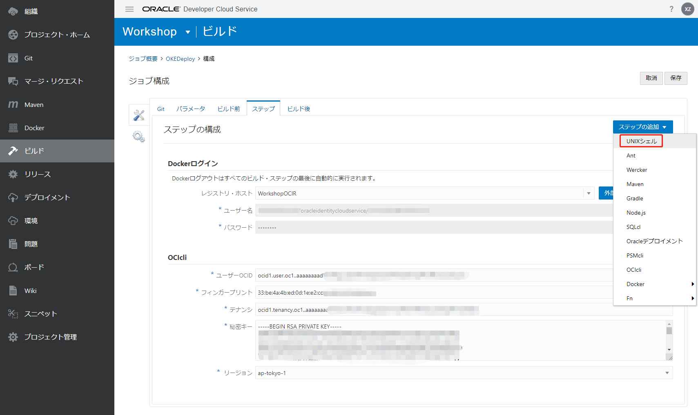
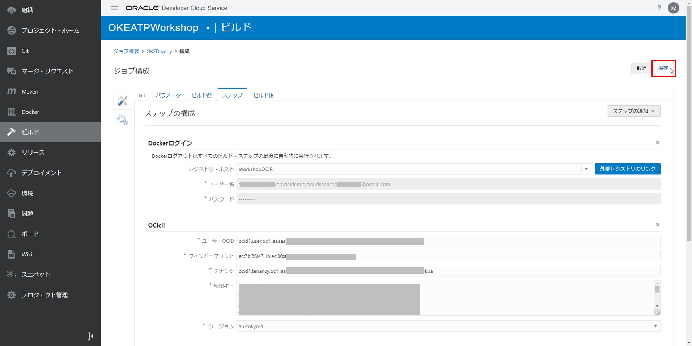

DevCSのビルド機能（CI/CD）を使用して、アプリケーションをOKEクラスタへのデプロイ
=====
このステップでは、新しいビルドジョブを作成して、セットアップしたOKEクラスタにアプリケーションをデプロイします。

以下の手順で実行します。

1. OKEクラスタにアプリケーションをデプロイするビルドジョブを構成する
2. ビルドジョブを実行する
3. デプロイしたアプリケーションを検証する

### 1. OKEクラスタにアプリケーションをデプロイするビルドジョブを構成する

DevCSで、「ビルド」に遷移して、「＋ジョブの作成」ボタンをクリックします。


下記項目を入力して、「作成」ボタンをクリックします。

+ 名前：任意、例えば、OKEDeploy
+ 説明：任意、例えば、"Deploy application to OKE"
+ テンプレート：OKE


「Git追加」から「Git」を選択します。


下記項目を入力します。

次のステップを追加します。「ステップ」をクリックします。

+ リポジトリ：ご利用のリポジトリを選択する
+ SCMコミット時に自動的にビルドを実行：チェックオンにする

[](images/1730.jpg "")

「ステップの追加」から「Docker」⇒「Dockerログイン」を選択します。


下記項目を入力します。

+ レジスト・ホスト：入力したレジストリ名を選択する。例えば、WorkshopOCIR


「ステップの追加」から「OCIcli」を選択します。


下記項目を入力します。

+ ユーザーOCID：ユーザーOCID
+ フィンガープリント：API Signingキーのフィンガープリント
+ テナンシ：テナントOCID
+ 秘密キー：API SigningのPrivateキーの内容（API SigningのPrivateキーのローカルパスではない）
+ リージョン：リージョン識別子。例えば、ap-tokyo-1


「ステップの追加」から「UNIXシェル」を選択します。



下記項目を入力します。

+ スクリプト：--cluster-idのあるコマンドは書き留めたコマンドへ差し替えてください（⇒OKEクラスタのkubeconfigファイルを作成するためのコマンド）

```
mkdir -p $HOME/.kube
oci ce cluster create-kubeconfig --cluster-id ocid1.cluster.oc1.ap-tokyo-1.aaaaaaaaaxxxxxxxxxxxxxxxxxxxxxxxxxxxxxxxxxxxxxxxxxxxxxxxxxxx --file $HOME/.kube/config --region ap-tokyo-1 --token-version 2.0.0
export KUBECONFIG=$HOME/.kube/config
wget https://storage.googleapis.com/kubernetes-release/release/v1.16.3/bin/linux/amd64/kubectl
chmod +x kubectl
./kubectl version
./kubectl config view
./kubectl get nodes
./kubectl delete statefulset okeatpapp --ignore-not-found=true
./kubectl apply -f okeatpapp.yaml
./kubectl get services okeatpapp
./kubectl get pods
./kubectl describe pods
```


「保存」ボタンをクリックします。



### 2. ビルドジョブを実行する

「今すぐビルド」ボタンをクリックします。


成功すると、ステータスがになります。

「ビルド・ログ」をクリックします。


成功すると、"Status:DONE Result:SUCCESSFUL"が表示されます。


### 3. デプロイしたアプリケーションを検証する

`kubectl get services | grep okeatpapp`でデプロイしたサービスのポートを確認します。

ワークショップでは、サービスのポートは"30561"になります。

```
NAME         TYPE        CLUSTER-IP     EXTERNAL-IP   PORT(S)        AGE
okeatpapp    NodePort    10.2.254.105   <none>        80:30561/TCP   10m
```

`kubectl get nodes -o wide`でOKEクラスタのワーカーノードのパブリックIP（EXTERNAL-IP）を確認します。

```
NAME        STATUS   ROLES   AGE   VERSION   INTERNAL-IP   EXTERNAL-IP       OS-IMAGE                  KERNEL-VERSION                   CONTAINER-RUNTIME
10.0.24.2   Ready    node    1d    v1.13.5   10.0.24.2     xxx.xxx.xxx.xxx   Oracle Linux Server 7.6   4.14.35-1902.2.0.el7uek.x86_64   docker://18.9.1
```

ブラウザを開いて、"http://パブリックIP:サービスのポート"に移動します。（※OKEクラスタのワーカーノードのサブネットが使用するセキュリティ・リストのイングレス・ルールに対して、サービスのポートを解放する必要があります）

aoneシステムのトップページが表示されます。


これで、アプリケーションをOKEへのデプロイは完了しました。

続いて [アプリケーションを修正し、再度DevCSのビルド機能（CI/CD）を使用して、OKEクラスタへのデプロイ](WorkshopGuide1000RedeployToOKECluster.md) に進んでください。

[ワークショップTopへ](../README.md)